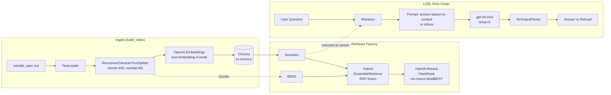
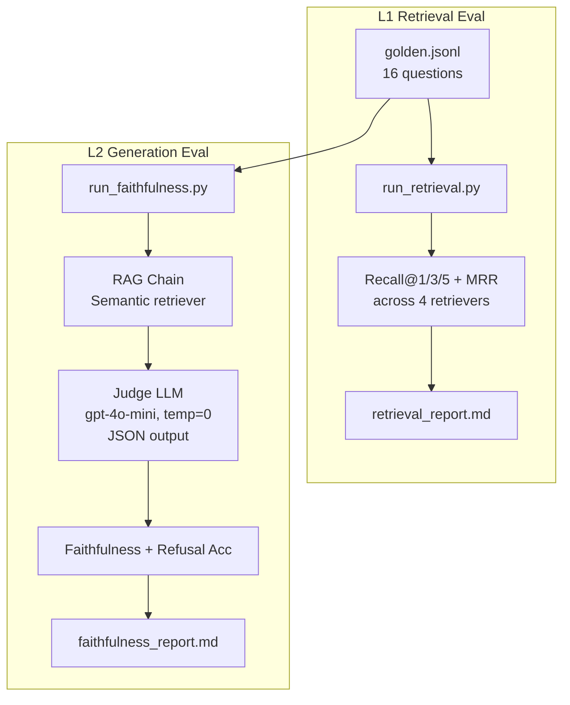

# Week 1 Summary — SoC Design AI Copilot

> 5 天從 0 到 production-grade RAG package，跑通 Retrieval + Generation 雙層 eval，repo 上線。

**Repo**: https://github.com/HyakunosukeOgata/soc-design-ai-copilot

---

## 一句話總結
**用 LangChain v1 + LCEL 做 SoC spec RAG，配 4 種 retriever 跟 LLM-as-judge，量化證明「最簡單的 semantic retriever 反而最強」。**

---

## 架構圖

### 系統 Pipeline


### Eval Pipeline（兩層測試）


### Package 結構
```
soc-design-ai-copilot/
├── pyproject.toml              # pip install -e .[dev]
├── README.md                   # 帶數據結果表
├── .env.example
├── data/sample_spec.md         # AXI4-Lite + SHA-256 + CDC FIFO + SV style
├── eval/
│   ├── golden.jsonl            # 16 Q&A (15 retrieval + 1 refusal)
│   └── reports/                # 自動產出
└── src/soc_copilot/
    ├── config.py               # 集中: paths, model, chunk
    ├── rag/
    │   ├── ingest.py           # build_index() -> (chunks, vs)
    │   ├── retriever.py        # make_retriever(kind, vs, chunks)
    │   └── chain.py            # make_rag_chain(retriever)
    ├── eval/
    │   ├── run_retrieval.py    # Recall@k + MRR
    │   └── run_faithfulness.py # LLM-as-judge
    └── demos/
        ├── rag_demo.py         # 4 question smoke test
        └── hybrid_demo.py      # 4-retriever side-by-side
```

---

## 5 天每日 Highlights

| Day | 學了什麼 | 關鍵領悟 |
|---|---|---|
| 1 | LangChain v1 / LCEL `\|` / agent vs chain | LCEL 是 Runnable composition，不是普通管線 |
| 2 | 5 件套 RAG: Loader→Splitter→Embed→Store→Retrieve | chunk_size 太小=斷句、太大=噪音多 |
| 3 | Semantic vs BM25 vs Hybrid + Reranker | 加 reranker 不一定變好（小 corpus + 通用 model）|
| 4 | Recall@k / MRR / LLM-as-judge / Refusal Acc | Eval 不只測 model，也在 audit 你的 golden set |
| 5 | Factory pattern / package / config 集中 | 重構讓「換 model」從改 N 個地方變成改 1 個 |

---

## 結果數字（要背）

### Retrieval (15 questions, K=5)
| Retriever       | R@1  | R@3  | R@5  | MRR   |
|-----------------|------|------|------|-------|
| **Semantic**    | 0.73 | 1.00 | 1.00 | **0.867** |
| BM25            | 0.60 | 0.87 | 0.87 | 0.711 |
| Hybrid          | 0.67 | 0.87 | 1.00 | 0.800 |
| Hybrid+Rerank   | 0.67 | 0.80 | 1.00 | 0.772 |

### Generation
- Faithfulness: **86.67%**（無 hallucination；2 FAIL 是合理拒答被誤判）
- Refusal Accuracy: **100%**

---

## 5 個面試核心 Soundbites

### 1. 為什麼最簡單的贏？
> 「我做了 retriever ablation：semantic 比 hybrid+rerank MRR 高 22%。Root cause 兩個：corpus 只有 11 chunks，BM25 飢餓；通用 ms-marco reranker 不懂 SoC 領域。**Lesson: measure before adding complexity.**」

### 2. Eval 是 audit 不是測試
> 「2 個被算 FAIL 的題目，分析後發現是模型正確拒答 spec 沒寫的功耗。這暴露 binary `should_refuse` schema 不夠用 — production 需要 `answerable / refusable / unanswerable` 三態。Eval pipeline 不只是測 model，也在 audit 你的 test set。」

### 3. Reproducibility 是底線
> 「Judge LLM 用 temperature=0 + 強制 JSON 輸出。否則你想觀察『prompt v1 vs v2 差 3%』，但 judge 自己就 ±5% 抖動 — signal 被 noise 蓋過。Eval 要的是 determinism 不是 creativity。」

### 4. Refusal-first
> 「Production RAG 拒答能力比答對能力更重要 — 寧可說『我不知道』也不能 hallucinate。我的 system prompt 強制『context 沒答案就回 I don't know』，refusal accuracy 100%。」

### 5. Factory pattern 的工程價值
> 「我把 retriever 從硬編碼變成 factory function `make_retriever(kind, vs, chunks)`。eval 腳本就是一個 for loop 跑 4 種 retriever，沒有 if-else 樹。新增第 5 種只要加一個 case，不用碰 eval 邏輯。」

---

## 必背術語清單

| 術語 | 一句話解釋 |
|---|---|
| **LCEL** | LangChain Expression Language — 用 `\|` 串 Runnable |
| **RRF** | Reciprocal Rank Fusion — Hybrid retriever 融合多源排名的方法 |
| **Cross-encoder** | Reranker 的底層架構，query+doc 一起算 score（比 bi-encoder 準但慢）|
| **MRR** | Mean Reciprocal Rank = 平均(1/正確答案排名) |
| **Faithfulness** | 答案是否 grounded in context（無 hallucination） |
| **Refusal Accuracy** | 該拒答時有沒有拒 |
| **LLM-as-judge** | 用 LLM 當裁判評估 RAG 答案品質 |
| **Domain fine-tune** | 救通用 reranker 的標準做法（用自家 corpus 微調）|
| **Synthetic Q&A** | 用 LLM 自動生 eval set 的方法（擴大 golden set 路徑）|

---

## Week 1 反省（5 題自答）

**Q1. 這週最卡的概念？**
A: Reranker 為什麼會讓 MRR 變差。一開始很挫折以為自己做錯，後來分析才理解是「小 corpus + 通用 model」的雙重問題。這變成最強的面試素材。

**Q2. LCEL 你敢在面試講解了嗎？**
A: 敢。`prompt | llm | parser` 背後是 Runnable composition；可 invoke / stream / batch / ainvoke；用 `RunnablePassthrough` 把原始 input 帶到下游。

**Q3. RAG 你能畫出完整 pipeline 嗎？**
A: 能（見上方 Mermaid）。Load → Split → Embed → Store → Retrieve → Prompt → LLM → Parser → Answer。

**Q4. Agent 的 thought-action-observation loop 你能背嗎？**
A: 部分。create_agent 的 tool calling 跑過了，但 ReAct 的明確 trace 還沒手寫過 — Week 2 補。

**Q5. 下週最擔心哪一天？**
A: Day 9-10 的 Docker + observability。FastAPI 沒問題（之前用過），但 LangSmith / Phoenix 還沒摸。

---

## Week 2 預覽
- Day 8: FastAPI 包 RAG 成 `/ask` endpoint + SSE streaming
- Day 9: Docker / docker-compose / .env 管理
- Day 10: 加 observability（LangSmith 或 OpenTelemetry）
- Day 11: Agent layer — 加 RTL lint tool
- Day 12-14: 整合 + 寫 demo video + 補 README

---

## Week 1 Done ✅
從「不會 LangChain」到「有 GitHub repo + eval 數字 + 面試 soundbites」。
週末充電，Week 2 把 RAG 變成真服務。
